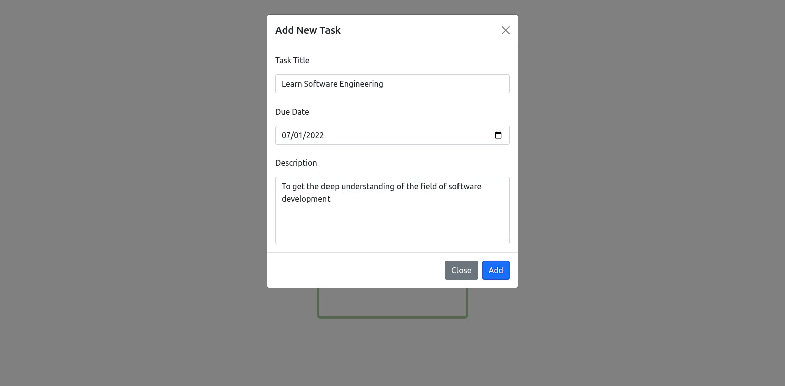
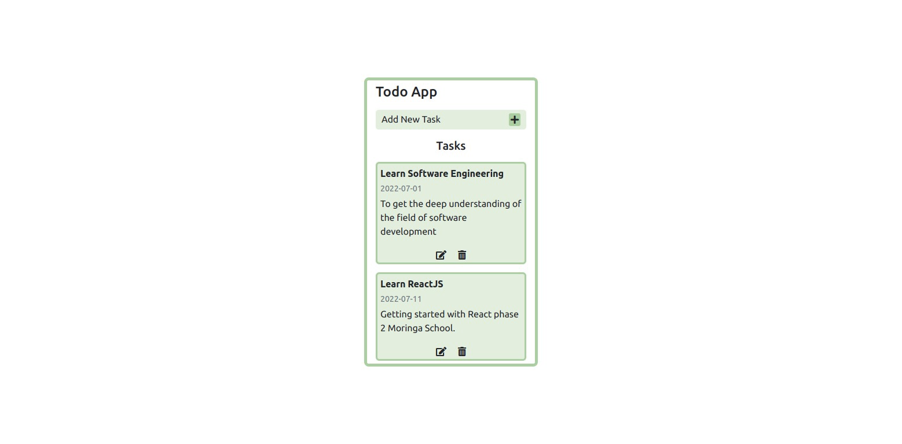
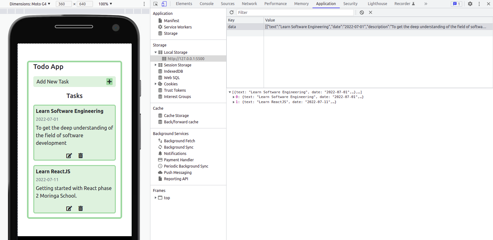

# Project : TODO APP

## Description 🚀

This project is specifically for learning the CRUD operations in JavaScript i.e

- `C`: Create
- `R`: Read
- `U`: Update
- `D`: Delete

CRUD is a type of mechanism that allows you to create data, read data, edit it, and delete those data.

## Screenshots 📸

### Add Task

 

### Displayed Task

 

## Storage 💾 used localStorage to store data

  

## Setup 🛠️

- Clone the repository using git clone `https://github.com/Douglas254/CRUD.git` or download and extract the CRUD zip file and cd into the To-Do-App folder.
- Open up the cloned folder in your preferred text editor. Open up a terminal within your workspace and navigate into the `To-Do-App` folder
- Open the live server vs code extension and get your site up and running on `http://127.0.0.1:5500`

## Deploy ~ GitHub Pages 🌍

To-Do App live link [here](https://douglas254.github.io/CRUD/To-Do-App/index.html)
 
Social media(CRUD-Basics) link [here](https://douglas254.github.io/CRUD/CRUD-Basics/index.html)

## Authors 🖊️

This project was contributed to by:

- [Douglas Obara](https://github.com/douglas254/)

## License 📄

The project is licensed under MIT
